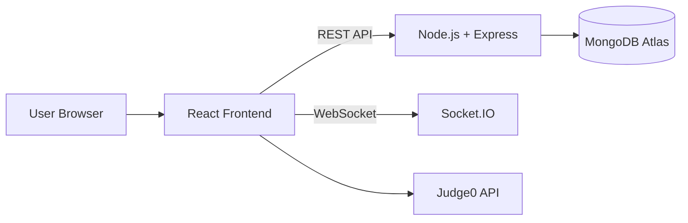
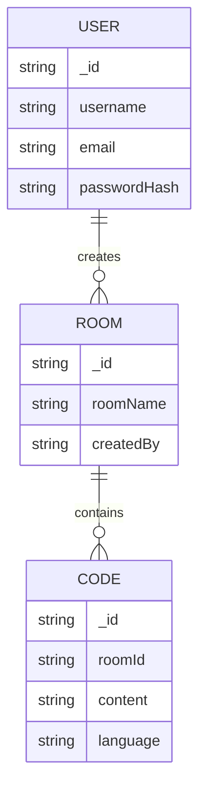
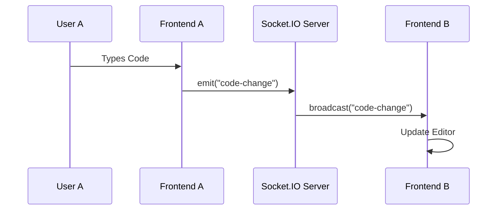
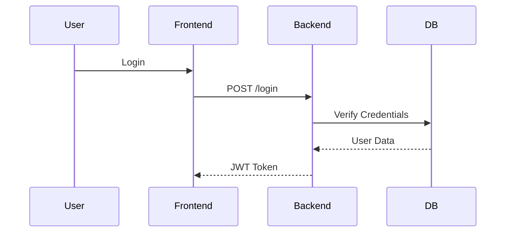

Perfect. Below is a **complete professional README.md** tailored exactly for your project.

You can copy-paste this directly into your GitHub `README.md`.

---

# 🚀 CodeCollab – Real-Time Collaborative Coding Platform

A full-stack real-time collaborative coding platform that allows multiple authenticated users to create or join coding rooms, edit code simultaneously, and execute programs securely using Judge0.

---

## 📌 Features

* 🔐 JWT-based Authentication (Register / Login)
* 👥 Create & Join Coding Rooms
* ⚡ Real-Time Code Synchronization (Socket.IO)
* 💬 Live Collaboration Support
* 🧠 Multi-language Code Execution (Judge0 API)
* ☁ Cloud Database Storage (MongoDB Atlas)
* 🌍 Deployed Frontend & Backend

---

## 🛠 Tech Stack

### Frontend

* React.js
* Tailwind CSS
* Socket.IO Client
* Axios (API communication)

### Backend

* Node.js
* Express.js
* Socket.IO
* JWT Authentication
* bcrypt (Password Hashing)

### Database

* MongoDB Atlas (Cloud)

### Code Execution

* Judge0 Public API (Sandboxed Execution)

### Deployment

* Frontend → Vercel
* Backend → Render

---

## 🏗 System Architecture



---

## 🗄 Database Design



---

## ⚡ Real-Time Editing Flow



---

## 🔐 Authentication Flow



---

## 🚀 How It Works

1. User registers and logs in.
2. JWT token is generated and used for protected routes.
3. User creates or joins a coding room.
4. WebSocket connection is established.
5. Code changes are broadcast to all users in the same room.
6. When “Run Code” is clicked, source code is sent to Judge0.
7. Execution result is displayed instantly.

---

## 🧠 Security Measures

* Passwords are hashed using bcrypt before storage.
* JWT ensures stateless authentication.
* Code execution is sandboxed via Judge0 (no local execution).
* Protected backend routes via middleware.

---

## 📦 Installation & Setup (Local)

### 1️⃣ Clone the repository

```bash
git clone https://github.com/Prabhudattapanda07/codecollab.git
cd codecollab
```

### 2️⃣ Backend Setup

```bash
cd backend
npm install
```

Create `.env` file:

```
MONGO_URI=your_mongodb_atlas_connection_string
JWT_SECRET=your_secret_key
```

Start backend:

```bash
npm start
```

### 3️⃣ Frontend Setup

```bash
cd frontend
npm install
npm start
```

---

## 🌍 Live Demo

Frontend: https://codecollab-orpin.vercel.app/
Backend: Hosted on Render

> Note: Backend may take up to 60 seconds to wake up if inactive (Render free tier cold start).

---

## 📈 Scalability Considerations

Future improvements:

* Redis adapter for scaling Socket.IO across multiple instances
* Self-hosted Judge0 for production reliability
* Load balancing for backend services
* CRDT/Operational Transformation for advanced conflict resolution

---

## 🎯 Limitations

* Judge0 public API has rate limits
* Render free tier introduces cold start delay
* Current synchronization uses broadcast-based strategy (last-write-wins)

---

## 🔮 Future Enhancements

* Real-time cursor tracking
* Private room invitations
* Code version history
* Docker-based execution engine
* Video/Voice collaboration

---

## 👨‍💻 Author

**Prabhudatta Panda**
Final Year Project – Collaborative Coding Platform

